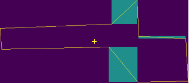
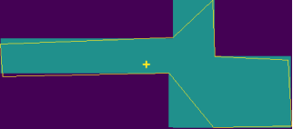
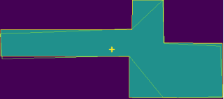

# Post-Processing 
## Step

1. Simplifying polygon by [DP algorithm](https://en.wikipedia.org/wiki/Ramer%E2%80%93Douglas%E2%80%93Peucker_algorithm)

   
2. Detecting occlusion, calculating box fill with 1 

3. Filling in reasonable sampling section

   
4. Output processed polygon

## performance
It works, and a performance comparison on the MatterportLayout dataset:

| Method | 2D IoU(%)  | 3D IoU(%) | RMSE | $\mathbf{\delta_{1}}$ |
|--|--|--|--|--|
without post-proc    | 83.52 | 81.11 | 0.204 | 0.951 |
original post-proc |83.12 | 80.71 | 0.230 | 0.936|\
optimized  post-proc | 83.48 | 81.08| 0.214 | 0.940 |

original:

optimized:

